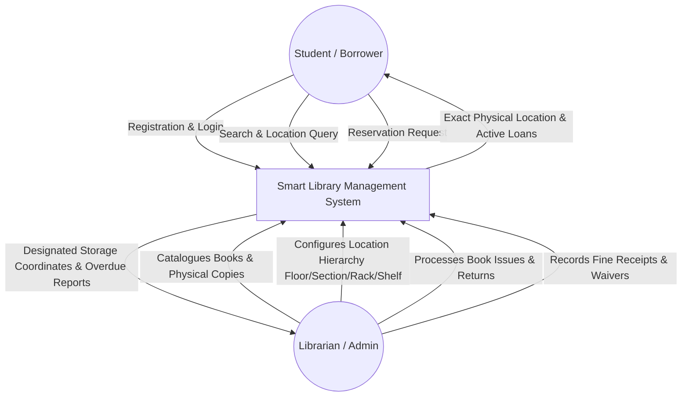
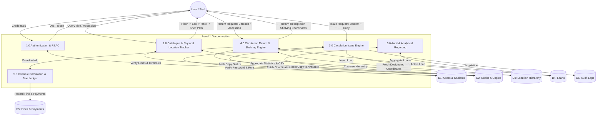

# Data Flow Diagram (DFD)

## Level 0: Context Diagram

```mermaid
graph TD
    Student((Student / Borrower))
    Staff((Librarian / Admin))
    System[Smart Library Management System]

    Student -->|Registration & Login| System
    Student -->|Search & Location Query| System
    Student -->|Reservation Request| System
    System -->|Exact Physical Location & Active Loans| Student

    Staff -->|Catalogues Books & Physical Copies| System
    Staff -->|Configures Location Hierarchy Floor/Section/Rack/Shelf| System
    Staff -->|Processes Book Issues & Returns| System
    Staff -->|Records Fine Receipts & Waivers| System
    System -->|Designated Storage Coordinates & Overdue Reports| Staff
```

---

## Level 1: Core Subsystems Data Flow

```mermaid
graph TD
    User((User / Staff))
    
    subgraph DFD_Level_1 [Level 1 Decomposition]
        P1[1.0 Authentication & RBAC]
        P2[2.0 Catalogue & Physical Location Tracker]
        P3[3.0 Circulation Issue Engine]
        P4[4.0 Circulation Return & Shelving Engine]
        P5[5.0 Overdue Calculation & Fine Ledger]
        P6[6.0 Audit & Analytical Reporting]
    end

    D1[(D1: Users & Students)]
    D2[(D2: Books & Copies)]
    D3[(D3: Location Hierarchy)]
    D4[(D4: Loans)]
    D5[(D5: Fines & Payments)]
    D6[(D6: Audit Logs)]

    User -->|Credentials| P1
    P1 <-->|Verify Password & Role| D1
    P1 -->|JWT Token| User

    User -->|Query Title / Accession| P2
    P2 <-->|Fetch Coordinates| D2
    P2 <-->|Traverse Hierarchy| D3
    P2 -->|Floor -> Sec -> Rack -> Shelf Path| User

    User -->|Issue Request: Student + Copy| P3
    P3 <-->|Verify Limits & Overdues| D1
    P3 <-->|Lock Copy Status| D2
    P3 -->|Insert Loan| D4
    P3 -->|Log Action| D6

    User -->|Return Request: Barcode / Accession| P4
    P4 <-->|Verify Active Loan| D4
    P4 -->|Reset Copy to Available| D2
    P4 -->|Overdue Info| P5
    P4 <-->|Fetch Designated Coordinates| D3
    P4 -->|Return Receipt with Shelving Coordinates| User

    P5 -->|Record Fine & Payments| D5
    P6 <-->|Aggregate Statistics & CSV| D2
    P6 <-->|Aggregate Loans| D4
```
