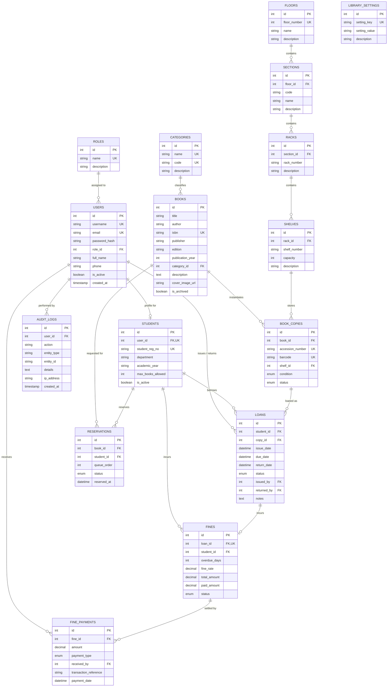

# Entity-Relationship Diagram (ERD)

## Normalized Relational Database Schema

```mermaid
erDiagram
    ROLES ||--o{ USERS : "assigned to"
    USERS ||--o| STUDENTS : "profile for"
    USERS ||--o{ LOANS : "issues / returns"
    USERS ||--o{ FINE_PAYMENTS : "receives"
    USERS ||--o{ AUDIT_LOGS : "performed by"

    CATEGORIES ||--o{ BOOKS : "classifies"
    BOOKS ||--o{ BOOK_COPIES : "instantiates"
    BOOKS ||--o{ RESERVATIONS : "requested for"

    FLOORS ||--o{ SECTIONS : "contains"
    SECTIONS ||--o{ RACKS : "contains"
    RACKS ||--o{ SHELVES : "contains"
    SHELVES ||--o{ BOOK_COPIES : "stores"

    STUDENTS ||--o{ LOANS : "borrows"
    STUDENTS ||--o{ FINES : "incurs"
    STUDENTS ||--o{ RESERVATIONS : "reserves"

    BOOK_COPIES ||--o{ LOANS : "loaned as"
    LOANS ||--o| FINES : "incurs"
    FINES ||--o{ FINE_PAYMENTS : "settled by"

    ROLES {
        int id PK
        string name UK
        string description
    }

    USERS {
        int id PK
        string username UK
        string email UK
        string password_hash
        int role_id FK
        string full_name
        string phone
        boolean is_active
        timestamp created_at
    }

    STUDENTS {
        int id PK
        int user_id FK, UK
        string student_reg_no UK
        string department
        string academic_year
        int max_books_allowed
        boolean is_active
    }

    FLOORS {
        int id PK
        int floor_number UK
        string name
        string description
    }

    SECTIONS {
        int id PK
        int floor_id FK
        string code
        string name
        string description
    }

    RACKS {
        int id PK
        int section_id FK
        string rack_number
        string description
    }

    SHELVES {
        int id PK
        int rack_id FK
        string shelf_number
        int capacity
        string description
    }

    CATEGORIES {
        int id PK
        string name UK
        string code UK
        string description
    }

    BOOKS {
        int id PK
        string title
        string author
        string isbn UK
        string publisher
        string edition
        int publication_year
        int category_id FK
        text description
        string cover_image_url
        boolean is_archived
    }

    BOOK_COPIES {
        int id PK
        int book_id FK
        string accession_number UK
        string barcode UK
        int shelf_id FK
        enum condition
        enum status
    }

    LOANS {
        int id PK
        int student_id FK
        int copy_id FK
        datetime issue_date
        datetime due_date
        datetime return_date
        enum status
        int issued_by FK
        int returned_by FK
        text notes
    }

    FINES {
        int id PK
        int loan_id FK, UK
        int student_id FK
        int overdue_days
        decimal fine_rate
        decimal total_amount
        decimal paid_amount
        enum status
    }

    FINE_PAYMENTS {
        int id PK
        int fine_id FK
        decimal amount
        enum payment_type
        int received_by FK
        string transaction_reference
        datetime payment_date
    }

    RESERVATIONS {
        int id PK
        int book_id FK
        int student_id FK
        int queue_order
        enum status
        datetime reserved_at
    }

    LIBRARY_SETTINGS {
        int id PK
        string setting_key UK
        string setting_value
        string description
    }

    AUDIT_LOGS {
        int id PK
        int user_id FK
        string action
        string entity_type
        string entity_id
        text details
        string ip_address
        timestamp created_at
    }
```
