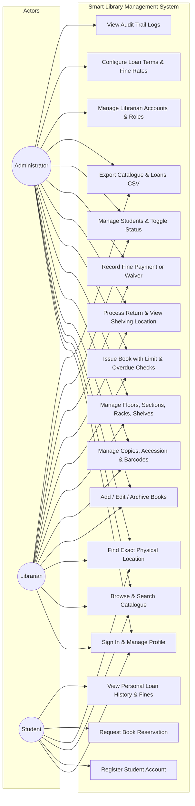

# Use-Case Diagram

## Role-Based Use Cases

```mermaid
graph LR
    subgraph Actors
        Admin((Administrator))
        Librarian((Librarian))
        Student((Student))
    end

    subgraph System [Smart Library Management System]
        UC_Auth[Sign In & Manage Profile]
        UC_Reg[Register Student Account]
        UC_Cat[Browse & Search Catalogue]
        UC_Find[Find Exact Physical Location]
        UC_Res[Request Book Reservation]
        UC_Hist[View Personal Loan History & Fines]
        
        UC_BookCRUD[Add / Edit / Archive Books]
        UC_CopyCRUD[Manage Copies, Accession & Barcodes]
        UC_LocMgr[Manage Floors, Sections, Racks, Shelves]
        UC_Issue[Issue Book with Limit & Overdue Checks]
        UC_Return[Process Return & View Shelving Location]
        UC_FinePay[Record Fine Payment or Waiver]
        UC_StuMgr[Manage Students & Toggle Status]
        UC_CSV[Export Catalogue & Loans CSV]
        
        UC_StaffMgr[Manage Librarian Accounts & Roles]
        UC_Settings[Configure Loan Terms & Fine Rates]
        UC_Audit[View Audit Trail Logs]
    end

    Student --> UC_Auth
    Student --> UC_Reg
    Student --> UC_Cat
    Student --> UC_Find
    Student --> UC_Res
    Student --> UC_Hist

    Librarian --> UC_Auth
    Librarian --> UC_Cat
    Librarian --> UC_Find
    Librarian --> UC_BookCRUD
    Librarian --> UC_CopyCRUD
    Librarian --> UC_LocMgr
    Librarian --> UC_Issue
    Librarian --> UC_Return
    Librarian --> UC_FinePay
    Librarian --> UC_StuMgr
    Librarian --> UC_CSV

    Admin --> UC_Auth
    Admin --> UC_Cat
    Admin --> UC_Find
    Admin --> UC_BookCRUD
    Admin --> UC_CopyCRUD
    Admin --> UC_LocMgr
    Admin --> UC_Issue
    Admin --> UC_Return
    Admin --> UC_FinePay
    Admin --> UC_StuMgr
    Admin --> UC_CSV
    Admin --> UC_StaffMgr
    Admin --> UC_Settings
    Admin --> UC_Audit
```
